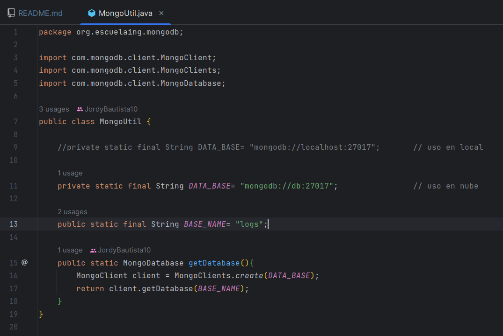
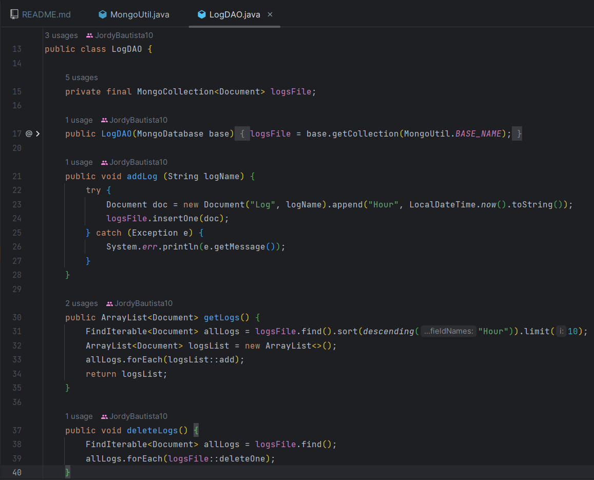
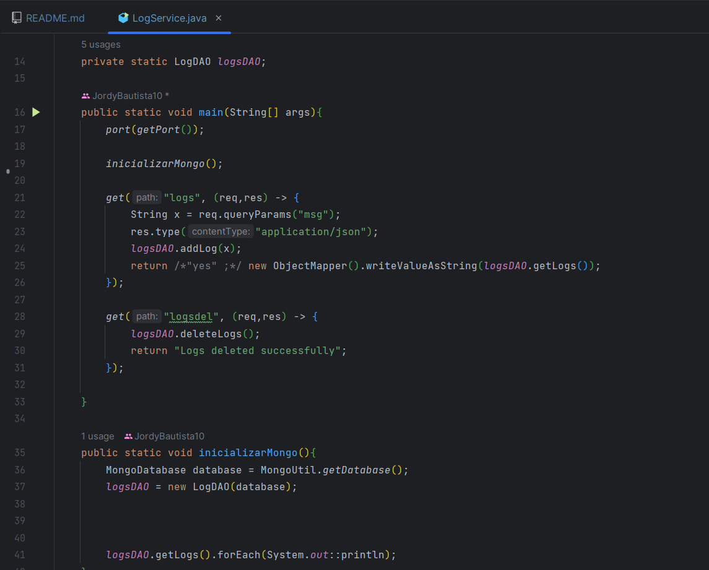
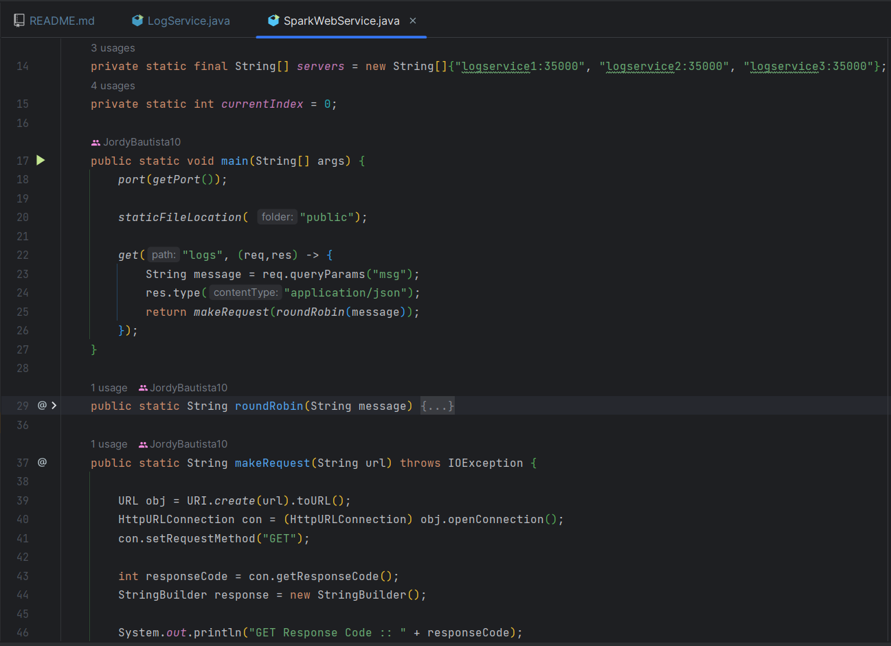
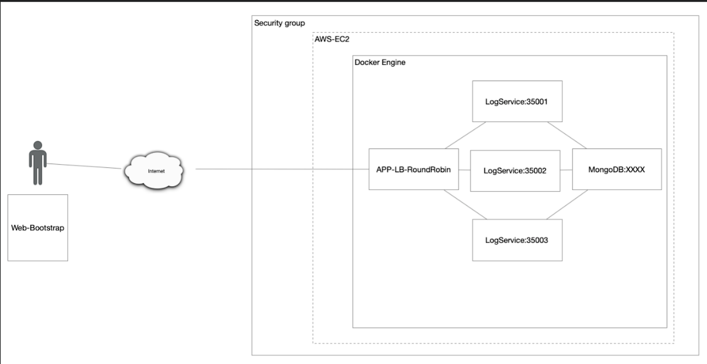
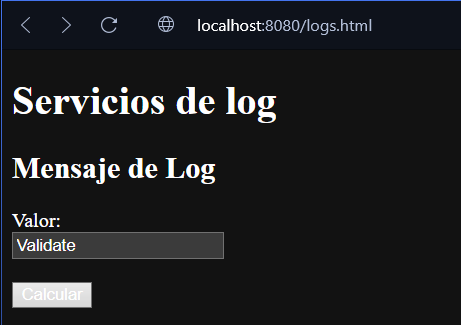
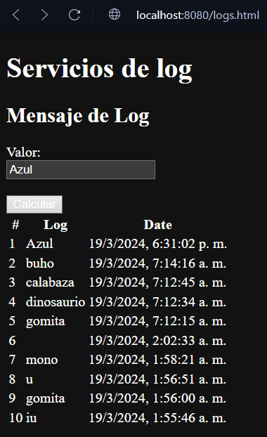

# AREP-Taller-6: PATRONES ARQUITECTURALES

Este proyecto tiene como objetivo manejar diferentes servicios, entender e interiorizar más el uso de Docker y por ultimo aprender e implemenar el despliegue en AWS.

## Prerequisitos

Para que el código corra de forma satisfactoria y se puedan seguir todos los pasos se necesitara de: Java, Maven, Git y Docker; sin embargo,  para la descarga e instalación de estos elementos, adjunto los link de material de apoyo de otros autores

* [Tutorial instalación Java] (https://youtu.be/4WKo13f2Qpc?si=lHG84Jp_k7YbBFmp)
* [Tutorial instalación Git] (https://youtu.be/jpTrSSjPlEo?si=VdcaXSaNEFkR3hCk)
* [Tutorial instalación Maven] (https://youtu.be/biBOXvSNaXg?si=wfySIfBTUERGEVZC)
* [Tutorial instalación Docker] (https://youtu.be/_et7H0EQ8fY)

## Construido con:

* [Java](http://www.dropwizard.io/1.0.2/docs/) - Lenguaje con el cual funciona la mayor parte del proyecto
* [Html](https://developer.mozilla.org/es/docs/Web/HTML) - Usado para la sección del cliente
* [JavaScript](https://developer.mozilla.org/es/docs/Web/JavaScript) - Este lenguaje le permite al cliente realizar las peticiones necesarias
* [Maven](https://maven.apache.org/) - Usado para la construcción de la estructura del proyecto
* [Git](https://git-scm.com) - Usado para el versionamiento
* [Docker](https://www.docker.com/products/docker-desktop/) - Es un software que permite crear imagenes y correr contenedores
* [Spark](https://mvnrepository.com/artifact/org.apache.spark/spark-core) - Framework con el cual se realizó el API

## Diseño

* MongoUtil: Se encarga de la conexión con la base de datos.
    

* LogDao: Se encarga de la administración de la base datos, es decir: crea, devuelve y elimina logs.
    

* LogService:Se encarga de iniciar la conexión con la base datos, además recibe las peticiones http y asi mismo se encarga de obtener la información que se requiere de la base de datos. 
    

* SparkWebsService: Se encarga recibir las peticiones http que realice el usuario, redirige las peticiones a la api de LogService, además con el método roundRobin se encarga de distribuir de manera equitativa las cargas para los servidores. 
    

## Arquitectura

La arquitectura brindada en este laboratorio consiste en tres partes fundamentales:
    

* ### LogService
    LogService es un servicio REST que recibe una cadena, la almacena en la base de datos y responde con las 10 últimas cadenas almacenadas en la base de datos y la fecha en que fueron almacenadas.
* ### MongoDB
    El servicio MongoDB es una instancia de MongoDB corriendo en un container de docker. Esta es una base de datos no relacional que se encarga de guardar en este caso logs(String, localDateTime)
* ### RounnRobin
  La aplicación SparkWebService está compuesta por un cliente web y al menos un servicio REST. En este caso el cliente web ingresara una cadena de texto y la enviara utilizando una petición get, dandole click aún boton, esta información la redireccionara a otra api quien se encarga de conectar con la base de datos. Además en esta aplicación, se tendra el metodo RounRobin que se encarga de distribuir las peticiones entre las tres instacias de servicios que ahi.  

## Para Comenzar

### Repositorio

En primera instancia, debemos obtener el código del proyecto, por lo que se ejecutara el comando desde consola. (tenga en cuenta que debe estar en la carpeta deseada antes de clonar el repositorio)

~~~
https://github.com/JordyBautista10/AREP-Taller-6.git
~~~

Se entra a la carpeta del proyecto:

~~~
cd AREP-Taller-6
~~~

Posteriormente, descargamos las dependencias necesarias y compilamos el código

~~~
mvn clean install compile
~~~

### Ejecución

Para ejecutar docker-compose, se deben crear las imágenes con los siguientes comandos:

~~~
 docker build -t sparkweb -f DockerFiles/DockerfileSP .
 ~~~
~~~
docker build -t logservice -f DockerFiles/DockerfileLS .
~~~

Ahora si para correr todo este conjunto de servicios, se debe ejecutar el siguiente comando:

~~~
docker-compose up -d 
~~~

### Pruebas

Una vez que se estén ejecutando todos los contenedores, dirígete al navegador de tu preferencia y coloca en el navegador la siguiente URL, e indica el archivo que deseas consultar, puede ser cualquiera que esté en la carpeta pública:

~~~
http://localhost:8080/logs.html
~~~

Debería aparecer una página como la siguiente:

Cuando ingresa un nuevo nombre de datos, se mostrará la lista de los 10 registros anteriores. Si no tienes 10 se mostrarán los que hay en el servidor:

#### Despliegue en AWS

* [Despliegue AWS](https://youtu.be/KLmHkzMWhM0)

### Versioning

Para el versionamiento se usó [Git](https://git-scm.com). Si necesita volver en alguna versión del código, visite los commits.

### Autor

* **Jordy Santiago Bautista Sepulveda** 

