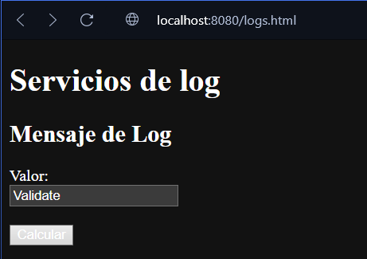
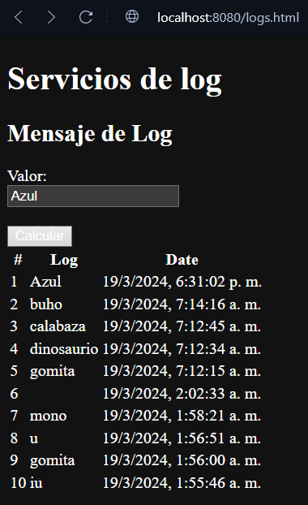

# AREP-Taller-6: TALLER DE TRABAJO INDIVIDUAL EN PATRONES ARQUITECTURALES

## Para Comenzar

#### Repositorio

En primera instancia, debemos obtener el código del proyecto, por lo que se ejecutara el comando desde consola. (tenga en cuenta que debe estar en la carpeta deseada antes de clonar el repositorio)

~~~
https://github.com/JordyBautista10/AREP-Taller-6.git
~~~

Posteriormente, descargamos las dependencias necesarias y compilamos el código

~~~
mvn clean install compile
~~~

#### Ejecución

Para correr todo este conjunto de servicios, se debe ejecutar el siguiente comando:

~~~
docker-compose up
~~~

#### Pruebas

Una vez que se estén ejecutando todos los contenedores, dirígete al navegador de tu preferencia y coloca en el navegador la siguiente URL, e indica el archivo que deseas consultar, puede ser cualquiera que esté en la carpeta pública:

~~~
http://localhost:8080/logs.html
~~~

Debería aparecer una página como la siguiente:

Cuando ingresa un nuevo nombre de datos, se mostrará la lista de los 10 registros anteriores. Si no tienes 10 se mostrarán los que hay en el servidor:

